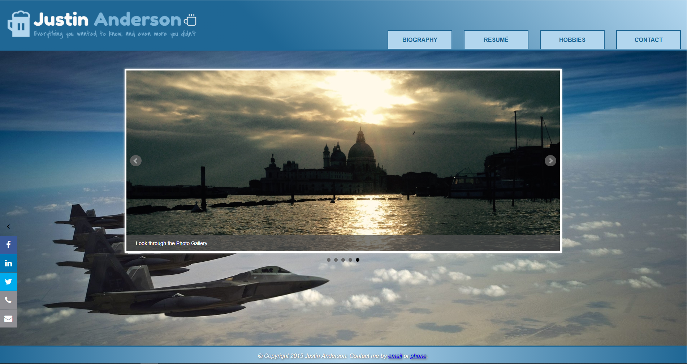

# CS601TermProject
CS601 Personal Website (Created on 12/2016; last successful build 09/2019)

Created a personal website using HTML5, CSS, JavaScript, and PHP. Includes Google Maps integration using personal trip photos tagged to various locations. This term project was completed for my first course in the Boston University - M.S. CIS program. 

This project can be run using any static web server. You can download XAMPP to host an Apache localhost server and navigate to the folder from there. 
